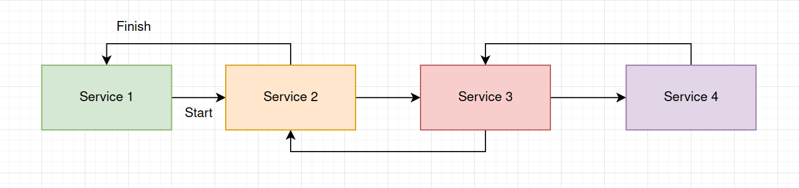
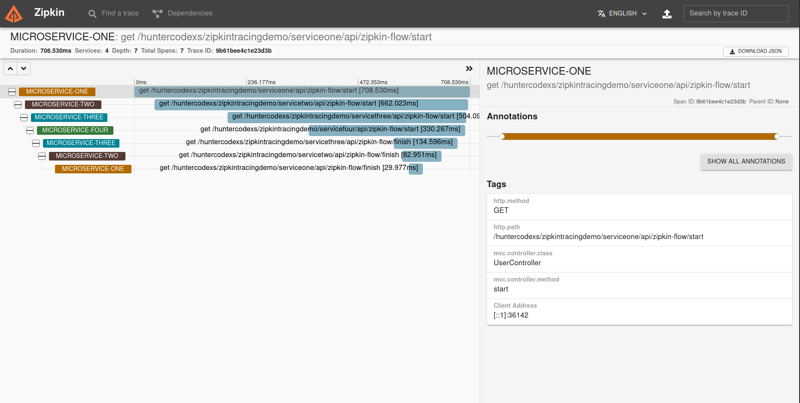

# ZIPKIN TRACING DEMO
A simple repository to present a complete trace environment

> TIP: To use this project with more facility, please check the Docker Series project in the repository/branch
> https://github.com/huntercodexs/docker-series/tree/elk_zipkin_v1, with this project you can easily create one
> environment to user together with this repository

- About

Below, we can see a simple diagram that shows the communication among microservices. In that diagram, there's one
start point and one finish point that indicate the start and end of a transaction. Look, there are four services.
Each one communicates with the next and previous service. It just exchanges information throughout the entire process,
starting and finishing with service one.

- How to execute

To execute this project you need run the request command showed below, you can use a Web Browser, The Postman Application
or any other resource that you have and can make an HTTP Request, for example Curl.

<pre>
[GET] http://localhost:31705/huntercodexs/zipkintracingdemo/serviceone/api/zipkin-flow/start
</pre>

- How to access Zipkin

<pre>
http://192.168.0.204:9411/zipkin
</pre>

- Explaining the Zipkin resources

- How to access the Kibana to get information about the requests

# Step by step
<small>How to prepare and execute the environment</small>

First of all you need to clone the project from https://github.com/huntercodexs/docker-series/tree/elk_zipkin_v1 via git
command and follow the instructions placed in the README file from that repository.

After that, execute the follow operations:

1- Clone this repository
<pre>
user@host:/home/user$ git clone https://github.com/huntercodexs/zipkin-tracing-demo.git .
user@host:/home/user$ cd zipkin-tracing-demo
user@host:/home/user/zipkin-tracing-demo$ ls -ltr
total 24
drwxrwxrwx 3 jereelton jereelton 4096 Apr 28  2022 resources
drwxrwxrwx 6 jereelton jereelton 4096 Dec 12 15:46 servicefour
drwxrwxrwx 6 jereelton jereelton 4096 Dec 12 15:46 servicetwo
drwxrwxrwx 6 jereelton jereelton 4096 Dec 12 15:46 serviceone
drwxrwxrwx 6 jereelton jereelton 4096 Dec 12 15:46 servicethree
-rwxrwxrwx 1 jereelton jereelton 1857 Jan 22 16:27 README.md
</pre>

2- Configure the application.properties for all services

3- Build each project (you may use your preferred IDE to make it easier)

4- Run each application using the jar file built previously, or just Run the project in the IDE

5- Start the transaction using a request URL as below
<pre>
[GET] http://localhost:31705/huntercodexs/zipkintracingdemo/serviceone/api/zipkin-flow/start
</pre>

6- Check the transaction in the Zipkin Dashboard Panel

